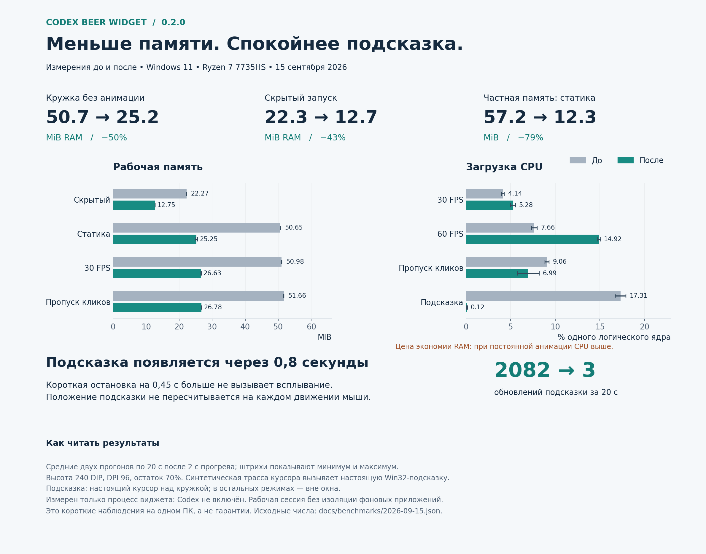

# Производительность 0.2.0: до и после



## Условия

15 сентября 2026, Windows 11 10.0.26200, AMD Ryzen 7 7735HS, 16 логических CPU.
Высота 240 DIP, DPI **96**, фиксированный демонстрационный остаток 70%.
Для каждого режима — два новых процесса, 2 секунды прогрева и 20 секунд измерения.
Это обычная рабочая сессия без изоляции фоновых приложений. Короткие прогоны на одном ПК
не доказывают универсальные пределы потребления или статистическую значимость разницы.

«До» — сохранённая сборка 0.1.2 (145f8d3) с исходным аппаратным рендерером и измерительным кодом.
Режим `hover-legacy` воспроизводит прежние вызовы позиционирования и активации подсказки при каждом
событии трассы. «После» — 0.2.0 (9cde39c), программная поверхность Direct2D, кеш текста и шрифтов,
задержка подсказки 800 мс и отключённая анимация её появления.
Это сравнение всего набора изменений, оно не изолирует вклад каждой оптимизации.

После смены DPI исходные замеры были повторены при том же DPI 96, что и итоговая версия.
Предварительная серия при DPI 120 используется ниже только для сравнения задержек между собой.
В основных режимах настоящий курсор находился вне окна. Для строки подсказки выполнен отдельный
парный тест: настоящий курсор неподвижен над жидкостью (83, 119 пикселей от начала окна),
а приложение воспроизводит ту же синтетическую трассу. Это воспроизводит обратную связь между
появлением подсказки и событиями мыши, обнаруженную при разборе жалобы пользователя.

## Результаты

В ячейках указаны среднее и диапазон двух прогонов. CPU — процент **одного логического ядра**,
для доли всей этой машины разделите число на 16. MiB = 1024² байт.
Рабочий набор и частная выделенная память — разные показатели; их нельзя складывать.

| Режим | CPU до → после, % ядра | Рабочая память до → после, MiB | Частная память до → после, MiB | FPS до → после |
|---|---:|---:|---:|---:|
| Скрытый запуск | 0.00 (0.00–0.00) → 0.00 (0.00–0.00) | 22.27 (22.24–22.30) → 12.75 (12.74–12.75) | 8.80 (8.55–9.05) → 2.06 (2.06–2.07) | 0.00 (0.00–0.00) → 0.00 (0.00–0.00) |
| Статичная кружка | 0.08 (0.08–0.08) → 0.00 (0.00–0.00) | 50.65 (50.61–50.70) → 25.25 (24.92–25.58) | 57.22 (57.22–57.22) → 12.25 (12.03–12.48) | 0.00 (0.00–0.00) → 0.00 (0.00–0.00) |
| Обычный, до 30 FPS | 4.14 (3.98–4.30) → 5.28 (5.00–5.55) | 50.98 (50.91–51.05) → 26.63 (26.55–26.71) | 58.27 (58.13–58.40) → 12.50 (12.18–12.82) | 29.15 (29.14–29.17) → 29.16 (29.15–29.16) |
| Плавный, до 60 FPS | 7.66 (7.34–7.97) → 14.92 (14.77–15.08) | 47.59 (47.56–47.62) → 26.60 (26.59–26.62) | 57.55 (56.70–58.40) → 12.08 (12.07–12.09) | 58.22 (58.20–58.24) → 58.02 (57.85–58.20) |
| Пропуск кликов, 30 FPS | 9.06 (8.83–9.30) → 6.99 (5.78–8.21) | 51.66 (51.64–51.68) → 26.78 (26.74–26.82) | 58.99 (58.92–59.05) → 12.96 (12.29–13.62) | 29.15 (29.15–29.16) → 29.15 (29.13–29.16) |
| Подсказка: сразу → 0,8 с | 17.31 (16.72–17.90) → 0.12 (0.08–0.16) | 51.72 (51.64–51.81) → 29.85 (29.64–30.05) | 58.28 (57.49–59.08) → 12.00 (11.79–12.21) | 0.00 (0.00–0.00) → 0.00 (0.00–0.00) |

Скрытый запуск не создаёт графику. После показа и взаимодействия с меню расход будет другим.
В отдельной парной проверке «показать → открыть/закрыть меню → скрыть горячей клавишей»:

| После скрытия уже использованной кружки | До | После |
|---|---:|---:|
| Рабочий набор, MiB | 36,17 | 28,61 |
| Частная память, MiB | 23,95 | 6,79 |

Это по одному снимку после проверки интерфейса, они не включены в двухкратное сравнение.
Освобождение объектов не гарантирует немедленного возврата всех страниц системным библиотекам.
Принудительное урезание рабочего набора не используется.

Меньшая память имеет цену: постоянная программная анимация потребляет больше CPU, особенно при 60 FPS.
Для сравнения и выбора аппаратного вывода сохранён `CodexBeerWidget.exe --gpu`.
Экономичный режим остаётся режимом по умолчанию: без изменений уровня анимационный таймер остановлен.
При включённой постоянной анимации предпочтение зависит от того, что важнее: RAM или CPU.

## Почему 0,8 секунды

Синтетическая шестисекундная трасса: движение 20 DIP/с, две паузы по 450 мс и длинная пауза 1,6 с.
Она вызывает настоящие Win32 API подсказки, но не двигает физический курсор.
Дрожание в пределах 4 DIP не считается новым намерением; при дальнейшем движении подсказка скрывается.
Её позиция фиксируется при показе. Нет обновления текста и активации на каждом сообщении мыши.

Расположение настоящего курсора существенно: вне кружки прежняя версия давала всего 0,08–0,23%
одного ядра при 800 вызовах за 20 секунд. Над кружкой появлялись дополнительные события мыши,
и нагрузка возрастала. Поэтому парный тест этого сценария показан в основной таблице;
контрольные числа без курсора над кружкой также сохранены в JSON (`hoverWithoutPhysicalPointer`).

В предварительной серии (DPI 120, одинаковый исходный рендерер, два прогона по 20 с):

| Задержка | Обновлений подсказки | CPU, % одного ядра |
|---|---:|---:|
| Прежнее немедленное поведение | 795–799 | 3,52–8,59 |
| 0,3 с | 10 | 1,33–1,64 |
| **0,8 с** | **3** | **0,78–0,94** |
| 1,2 с | 1–2 | 0,31–0,86 |

0,3 с реагирует на короткие остановки. 1,2 с требует более долгого ожидания и пропускает часть
остановок в конце короткого теста. 0,8 с — практический компромисс отзывчивости и числа появлений,
а не доказанный универсальный оптимум. Итоговая версия дополнительно отключает fade/animate эффекты
самой подсказки. Итоговые CPU и число обновлений указаны в JSON и инфографике.

## Опрос реального Codex

Отдельные прогоны экономичного режима по 30 секунд после 2 секунд прогрева.
Интервалы 2 и 10 секунд; уведомлений от Desktop в обоих случаях не получено.
Служебные процессы измеряются отдельно, их память **не включена** в графики виджета.

| Показатель | 2 секунды | 10 секунд |
|---|---:|---:|
| CPU виджета, % ядра | 0,42 | 0,73 |
| Рабочая память виджета, MiB | 25,96 | 26,54 |
| Число служебных процессов Codex | 2 | 2 |
| Рабочая память Codex, MiB | 55,20 | 54,52 |
| CPU Codex после инициализации, % ядра | 1,75 | 1,10 |
| Успешных чтений / время наблюдения источника | 12 / 31,23 с | 4 / 31,26 с |
| Последнее чтение, мс | 1127 | 1352 |

Живые данные и число кадров менялись между прогонами. Меньший CPU виджета в первом прогоне
не означает, что частый опрос дешевле: короткие наблюдения не изолируют эту зависимость.
Служебный CPU измеряется от инициализации до последнего чтения, виджет — за свой 30-секундный интервал.
Опрос не гарантирует новое значение строго каждые 2 секунды: при долгом ответе он ждёт,
затем откладывает следующий запрос на полный интервал. Запросы не перекрываются и не накапливаются.
По умолчанию сохранены 10 секунд; пользователь может выбрать 2, 5, 10, 30 или 60.
При скрытии остаются 300 секунд, после ошибок действует увеличение задержки.

## Что изменено

- Direct2D рисует в повторно используемую BGRA-поверхность. Вывод — UpdateLayeredWindow;
  в режиме пропуска кликов больше не требуется чтение кадра обратно с GPU.
- Устройство создаётся при первом показе, освобождается при скрытии. Графические DLL загружаются по требованию.
- Для Segoe UI используется коллекция из двух установленных шрифтов вместо перечисления всей системы;
  если создать её нельзя, остаётся стандартная коллекция DirectWrite. Шрифты Windows не включаются в пакет.
- Разметки текста пересоздаются только при смене подписи или размера текста. Поверхность, кисти и маска используются повторно.
- Подсказка использует один отложенный таймер, не следует за каждым движением мыши и не анимирует появление.

Подход программного вывода в layered window описан в
[Microsoft: Layered Windows with Direct2D](https://learn.microsoft.com/en-us/archive/msdn-magazine/2009/december/windows-with-c-layered-windows-with-direct2d).
Расход ресурсов подтверждается собственными измерениями выше, а не выбором API.

## Повторение

```powershell
./tools/performance-suite.ps1 -Executable ./build/Release/CodexBeerWidget.exe -Tag repeat -Seconds 20 -Repeats 2 -Modes hidden,static,normal,smooth,clickthrough,hover800
./tools/performance-suite.ps1 -Executable ./build/Release/CodexBeerWidget.exe -Tag live2 -Seconds 30 -Repeats 1 -Modes live -RefreshSeconds 2
python tools/performance-infographic.py
```

Перед тестом завершите работающий виджет. Демонстрационные режимы не расходуют лимит и не сохраняют настройки.
`live` выполняет настоящие чтения квоты через установленный Codex. Для графика требуется matplotlib,
для самого приложения Python не нужен. Проверяйте одинаковый DPI, размер, конфигурацию и условия машины.

[Исходные числа](benchmarks/2026-09-15.json) · [SVG инфографики](performance-020.svg) ·
[Исторический замер 0.1.0](PERFORMANCE.md) · [Приёмка и ограничения](RELEASE-CHECKLIST.md)

